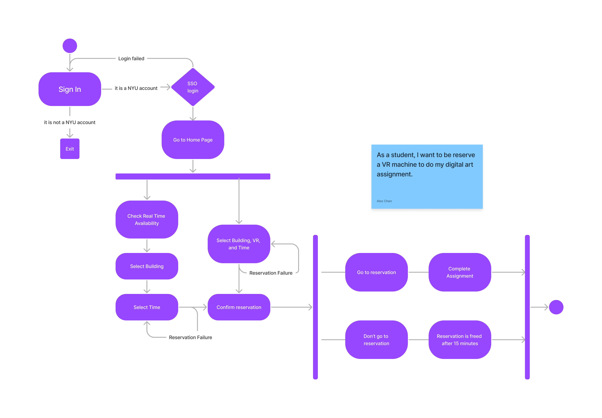

# Specification Phase Exercise

A little exercise to get started with the specification phase of the software development lifecycle. See the [instructions](instructions.md) for more detail.

## Team members

Daniel Atlas Github profile: https://github.com/Spectraorder

Eduarda Martini Github profile: https://github.com/ezmartini

Alex Chen Github profile: https://github.com/TheAlexanderChen

Ian Liao Github profile: https://github.com/ian-Liaozy

## Stakeholders

Our intended stakeholders are NYU students who use NYU spaces, like libraries, dining halls, or technology centers, for any reason.  

### Link to "interview" (Google Form)

https://forms.gle/wTKkD35TMF552f8G9

### Stakeholders we interviewed: 
Claire is an NYU student who uses NYU reservation systems to quickly find priority seating on campus, to better organize her day, to have access to a place to convene with others, or to find a private spot on campus. Her biggest issue with the current NYU reservation system is its unintuitive interface, and confusing drop-down menus– both of which add a little frustration when trying to navigate through the page. On the other hand, Claire likes knowing the features of the room before she books it, and would like to see the same predictability throughout the redesigned app– with access to real time information about seat availability and busyness. 

## Product Vision Statement

NYU students are in need of a comprehensive and unified reservation system for Bobst, dining areas, technology, and classrooms, yet the current implementations are messy and fragmented, so we intend to create an interactive, real-time reservation system to not only unify the system but also add additional needed functionality. 

## User Requirements

### User Stories

- As a student, I want to know which classrooms aren’t in use so I can host a meeting. 

- As a commuter, I want to know which computer labs are open so I can find a place to charge my computer. 

- As a student, I want to see real-time data about multiple NYU buildings, so I can choose which one to go to after class. 

- As a commuter, I want to be able to reserve a single seat so I don't have to use a study room. 

- As a commuter, I want to be able to see predictions for when Bobst is less busy, so I can schedule a meeting in Bobst during that time. 

- As a student, I want reserve any room not currently in use, so I can host a last minute meeting. 

- As a commuter, I want to reserve a single seat in advance so I will have somewhere to sit between classes, reliably.

- As a student, I want to reserve a console so I can play games with friends. 

- As a student, I want to reserve a study space so that I can have a silent study environment.

- As a student, I want to be reserve a VR machine to do my digital art assignment. 

## Activity Diagrams

User making a room reservation.

</a>

User making a reservation for VR.

</a>

## Wireframe Diagrams

## Clickable Prototype

[Link to prototype](https://www.figma.com/file/1qeYtmnA9MI0NV0ljpfuT5/prototype?node-id=0%3A1)